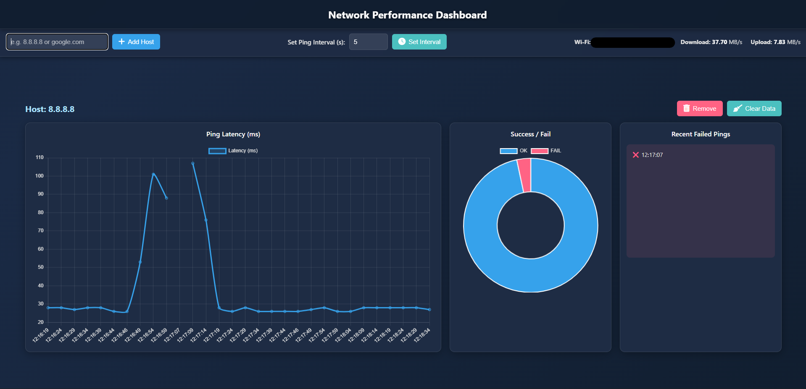

# 🌐 Network Monitor Dashboard

A **Flask-based web app** for monitoring **ping latency**, **network status**, and **connection speed** in real time.  It displays interactive charts using **Chart.js** and automatically updates data from the Python backend.


## ⚙️ Main Features

✅ Monitor multiple hosts (e.g., `8.8.8.8`, `google.com`)  
✅ Visualize latency and success/failure rates with Chart.js  
✅ Automatic background **Speedtest** (download/upload/SSID)  
✅ Real-time dashboard updates  
✅ REST API for network data  
✅ Built-in **SQLite** database via SQLAlchemy  


## 🧩 Requirements

- Python 3.9+
- Flask
- Flask-SQLAlchemy
- APScheduler
- psutil
- speedtest-cli


## 🚀 Getting Started

1. Clone the repository::

   ```bash
   git clone https://github.com/<your-username>/network-monitor-dashboard.git
   cd network-monitor-dashboard
   ```

2. Install all dependencies with:

    ```bash
    pip install -r requirements.txt
    ```

3. Run the Flask server:

   ```bash
   python app.py
   ```

4. Open in your browser:

   ```
   http://[IP_Address_of_the_machine]:5000
   ```


